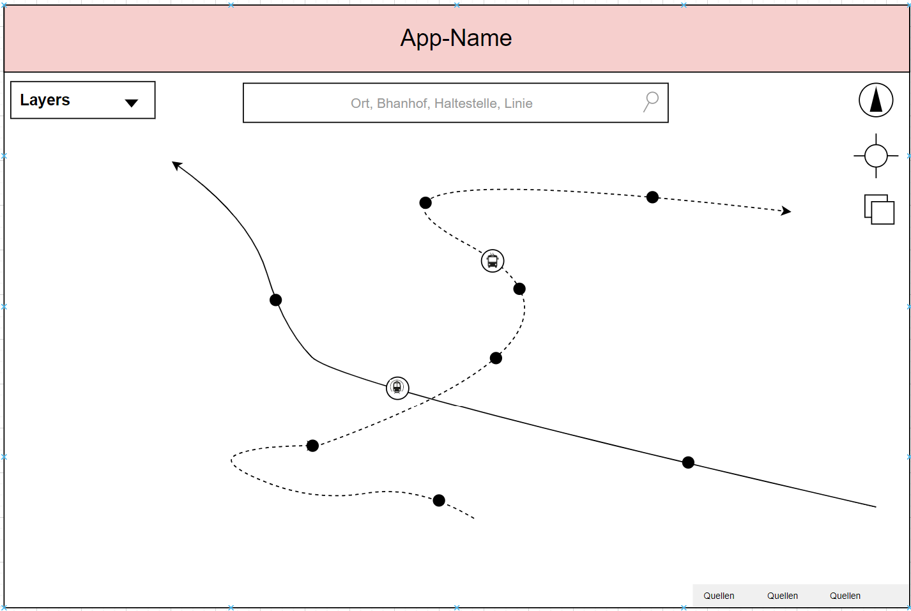

Text can be **bold**, _italic_, or ~~strikethrough~~.

[Link to another page](./another-page.html).

There should be whitespace between paragraphs.

There should be whitespace between paragraphs. We recommend including a README, or a file with information about your project.

# Header 1

This is a normal paragraph following a header. GitHub is a code hosting platform for version control and collaboration. It lets you and others work together on projects from anywhere.

## Motivation {#motivation}

> This is a blockquote following a header.
>
> When something is important enough, you do it even if the odds are not in your favor.

### Header 3

```js
// Javascript code with syntax highlighting.
var fun = function lang(l) {
  dateformat.i18n = require('./lang/' + l)
  return true;
}
```

```ruby
# Ruby code with syntax highlighting
GitHubPages::Dependencies.gems.each do |gem, version|
  s.add_dependency(gem, "= #{version}")
end
```

#### Header 4

*   This is an unordered list following a header.
*   This is an unordered list following a header.
*   This is an unordered list following a header.

##### Header 5

1.  This is an ordered list following a header.
2.  This is an ordered list following a header.
3.  This is an ordered list following a header.

###### Header 6

| head1        | head two          | three |
|:-------------|:------------------|:------|
| ok           | good swedish fish | nice  |
| out of stock | good and plenty   | nice  |
| ok           | good `oreos`      | hmm   |
| ok           | good `zoute` drop | yumm  |

### There's a horizontal rule below this.

* * *

### Here is an unordered list:

*   Item foo
*   Item bar
*   Item baz
*   Item zip

### And an ordered list:

1.  Item one
1.  Item two
1.  Item three
1.  Item four

### And a nested list:

- level 1 item
  - level 2 item
  - level 2 item
    - level 3 item
    - level 3 item
- level 1 item
  - level 2 item
  - level 2 item
  - level 2 item
- level 1 item
  - level 2 item
  - level 2 item
- level 1 item

### Small image


### Large image


### Definition lists can be used with HTML syntax.

<dl>
<dt>Name</dt>
<dd>Godzilla</dd>
<dt>Born</dt>
<dd>1952</dd>
<dt>Birthplace</dt>
<dd>Japan</dd>
<dt>Color</dt>
<dd>Green</dd>
</dl>

```
Long, single-line code blocks should not wrap. They should horizontally scroll if they are too long. This line should be long enough to demonstrate this.
```

```
The final element.
```

## Ziel {#ziel}

## App {#app}
### Wichtige features {#wichtige-features}
### Anwendung {#anwendung}

## Frontend {#frontend}

### Programmier sprache {#programmier-sprache}
### Website Konzept {#website-konzept}
#### Mainpage {#mainpage}
##### GUI {#GUI_main}



##### Farben {#farben_main}

#### Infopage {#infopage}

##### GUI {#GUI_info}


##### Farben {#farben_info}

## Backend {#backend}


### Datenabfrage {#Datenabfrage}

#### Datenherkunft {#Datenherkunft}
Zuerst wollten wir intuitiv die Daten von der SBB oder OpenData.ch beziehen. Leider sind alle diese API's etwas anderes als wir benötigen oder / und sie sind nicht zugänglich für nichts zahlende Studenten. So endeten wir bei GeoOps. 

#### Limitationen in der Genauigkeit {#Limitationen1}
Die Positionierungsgenauigkeit ist uns nicht bekannt, ebenfalls ist uns nicht bekannt über welche Hard & Software die Positionierung erstellt wird.

Und wurde vom Opendata-Verantworlichen* der SBB bestätigt, was ebenfalls bei GeoOps im kleingedruckten steht: Die Aktuelle Position der Züge gibt es in Westeuropa nicht. Es gibt keinen Datensatz, der unseren Use-case tatsächlich abdeckt. 

*Kontakt konnte nur hergestellt werden indem auf GitHub ein Issue eröffnet wurde

Alle Vorbilder wie folgende sind sommit nicht akkurat. Das heisst die gezeigten Positionen sind nicht real, sondern nur Interpolationen aus den Streckenabschnitten, den Abfahrtszeiten und Verspätungen.
[https://maps.trafimage.ch/](https://maps.trafimage.ch/ch.sbb.netzkarte?baselayers=ch.sbb.netzkarte,ch.sbb.netzkarte.dark,ch.sbb.netzkarte.luftbild.group,ch.sbb.netzkarte.landeskarte,ch.sbb.netzkarte.landeskarte.grau&lang=de&layers=ch.sbb.puenktlichkeit-ferry,ch.sbb.puenktlichkeit-bus,ch.sbb.puenktlichkeit-tram,ch.sbb.puenktlichkeit-nv,ch.sbb.puenktlichkeit-fv,ch.sbb.ch_gemeinden,ch.sbb.netzkarte.buslinien,ch.sbb.bahnhofplaene.printprodukte&x=959424.28&y=5870241.48&z=9.46)
[https://www.map.signalbox.io/](https://www.map.signalbox.io/?train=202402276727821&location=@52.59865,-1.98746,9Z)
[https://mobility.portal.geops.io/](https://mobility.portal.geops.io/world.geops.transit?layers=paerke,strassennamen,haltekanten,haltestellen,pois,tramlinien,world.geops.traviclive&x=941076.59&y=5983545.01&z=9.18)

Wir haben auch keine Angaben zu der Genauigkeit temporalen Auflösung, wir werden jedoch selbst aus im nächsten Kapitel folgenden Gründen darauf beschränken, die Daten in grösseren Zeitlichen Abständen zu beziehen als für eine Produktive App eigentlich notwendig:

#### Limitationen im Zugriff {#Limitationen2}
Da die SBB & OpenData -Spuren beide im Sand verliefen nutzen wir nun die Daten der [GeoOps-API](https://developer.geops.io/apis/realtime). Diese ist eigentlich eine kostenpflichtige API aber bietet eine gratis Testmöglichkeit nachdem man einen Account erstellt hat. Das Pricing ist in folgender Tabelle ersichtlich:

| SERVICE | UNIT | CREDITS |
|:------------------ |:-------------------:| -------------------:|
| Maps Standard | 1000 requests for vector tiles | 1 |
| Maps Raster | 1000 requests for raster map tiles | 10 |
| Routing | 1000 routing requests | 25 |
| Stops | 1000 search requests for stops | 10 |
| Realtime via Get | 1000 requests for vehicle position, stop times | 5 |
| Realtime via Websocket | 1000 minutes of open websocket connection | 50 |

Hierbei hat man 100 Credits pro Monat zur Verfüguung. Wir haben verschiedene Accounts die wir jeweils durchswapen können.


### alternative API {#laternative_API}

* allgemeine Zugstörungsinformationen oder alle anderen Daten der SBB auf diesem Portal über die folgenden Links:
https://data.sbb.ch/explore/dataset/rail-traffic-information/api/
https://data.sbb.ch/api/explore/v2.1/console
https://data.sbb.ch/explore/?sort=modified


* Haltestellen des öffentlichen Verkehres
https://www.geocat.ch/geonetwork/srv/ger/catalog.search#/metadata/841d42ff-8177-4e07-a96b-e8e5455ae048


## Daten {#daten}

#### Slicing
Pascal

#### Weiterverarbeitung
Pascal

### Bezugssystem {#bezugssystem}
### Quellen {#quellen}